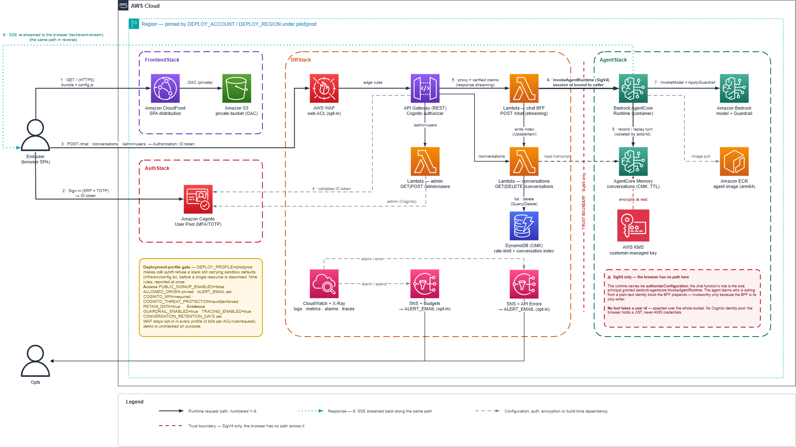

# Agentic apps on AWS

Putting an agent in front of real users takes far more than the agent. This is the rest of it,
deployable in one command.

A Strands agent on Amazon Bedrock AgentCore Runtime, a React chat UI, and a Lambda BFF between them —
with Cognito auth, durable per-user conversations, content guardrails, per-caller quotas, end-to-end
tracing and the CDK for all of it already written and tested.

The domain is deliberately thin: a general-purpose assistant with two example tools. What you inherit
is the scaffolding, not someone else's product.

## What you get

| | |
|---|---|
| **Agent** | Strands on AgentCore Runtime. Its tools act for the signed-in user **without ever accepting a user id** — asserted over the whole toolset |
| **Chat UI** | React + Vite: streaming replies, Markdown, a conversation sidebar, an admin panel, a small UI kit, i18n (en-US, pt-BR) |
| **Transport** | A Lambda BFF, the only path to the agent — per-caller quotas, and session ids bound to the authenticated caller |
| **Conversations** | Durable on AgentCore Memory: survives a restart, isolated per user by `actorId`, encrypted with the deployment's own KMS key, expired on a retention you declare |
| **Auth** | Cognito — self sign-up or invite-only behind one variable, optional TOTP, localized emails, and admin invites from the browser |
| **Safety** | An opt-in Bedrock guardrail: content filters, prompt-attack detection, PII anonymization. Required under `pilot` and `prod` |
| **Evidence** | OpenTelemetry end to end — the ADOT layer on every Lambda and X-Ray on the API stage, GenAI-convention spans and token metrics from the agent in CloudWatch, a `traceparent` that makes all three one trace, and a correlation id minted in the browser that reaches the stored turn |
| **Infrastructure** | Four CDK stacks, and a **deployment-profile gate** that refuses to synthesize a pilot still carrying sandbox defaults |
| **Controls** | Retention, alarms, an account budget, stage throttling, an optional WAF — each off by default, each documented with what it bills for |

## Quick start

Needs Node 22+, npm 10+ (declared in `engines`; `.nvmrc` pins the major, so `nvm use` picks it up),
Docker with Buildx, AWS credentials, and access to AgentCore Runtime and to the model in
`BEDROCK_MODEL_ID`.

```bash
npm run bootstrap                       # installs the root package and all four subpackages
cp infra/.env.example infra/.env        # set PROJECT_NAME — it prefixes every resource
npm --prefix infra run cdk -- bootstrap # CDK's own bootstrap: once per account+region
npm run deploy
```

The two `bootstrap`s are unrelated: the first installs dependencies, the third provisions the CDK
toolkit stack this account and region needs before it can take an asset. Skip it if the target is
already CDK-bootstrapped; run it against the same account and region you are deploying to.

The defaults in `.env.example` deploy a working sandbox — `us-east-1`, `DEPLOY_PROFILE=demo`, self
sign-up on — so `PROJECT_NAME` is the only value a first deploy has to set. `deploy` builds the app
artifacts and deploys the four stacks, pausing for confirmation on any change that widens IAM.

When it finishes, the `frontend` stack outputs `DistributionUrl`. Open it, create an account, and the
agent answers. To make that account an admin, see
[infra/README.md](infra/README.md#managing-users-and-admins); for what every variable does, see
[infra/.env.example](infra/.env.example).

If that first message comes back refusing on **model access** rather than answering, the account has
no Marketplace agreement for the model yet — a one-time step this deploy cannot take for itself, and
the one failure here that a green `cdk deploy` does not predict. The fix, and why it is not an IAM
change, is in
[infra/README.md](infra/README.md#model-access-is-denied-on-the-first-message).

## Architecture

<picture>
  <source media="(prefers-color-scheme: dark)" srcset="media/poc-strands-agents-bedrock-agentcore-bff-dark.png">
  
</picture>

The browser authenticates with Cognito and posts to the BFF with its ID token; API Gateway's Cognito
authorizer validates it and hands the verified claims to the Lambda; the BFF invokes AgentCore over
SigV4 and re-streams the response. (The diagram's right-hand side shows where external tool
integrations attach — this template ships two in-process ones and no external ones.)

The BFF is the only path to the agent, and that is a security boundary rather than a layering
preference — [chatbot-bff/README.md](chatbot-bff/README.md#why-the-bff-is-the-only-transport) sets
out why, and which tests hold it in place.

## Repository structure

```text
agent/               Strands agent runtime, its toolset, and the image build
chatbot-frontend/    React + Vite chat UI, admin panel, UI kit and i18n
chatbot-bff/         Lambda BFF: the chat proxy, the admin and conversation routes
infra/               AWS CDK app for auth, the runtime, the BFF and hosting
docs/                Long-form documentation — the engineering assessment
```

Each has its own README: [agent](agent/README.md) · [frontend](chatbot-frontend/README.md) ·
[bff](chatbot-bff/README.md) · [infra](infra/README.md).

Adapting this template with a coding agent? [AGENTS.md](AGENTS.md) tells it which parts are example
domain to replace and which are the scaffolding to preserve, with the test that guards each one.

An independent engineering assessment — readiness for demos, closed pilots with sensitive data, and
public production, scored by dimension with a prioritized backlog — is in
[docs/assessment.md](docs/assessment.md).

## Making it yours

| To change | Edit |
|---|---|
| What the agent is and how it behaves | `agent/src/agent.ts` — the system prompt |
| What the agent can do | `agent/src/tools.ts`, plus any IAM grant in `infra/src/stacks/agent-stack.ts` |
| Product name, tagline, icon | `chatbot-frontend/src/lib/brand.ts` |
| Colours and type | `chatbot-frontend/src/styles.css` — every component resolves to a token here |
| Copy, in both languages | `chatbot-frontend/src/lib/i18n/messages/` |
| Stack and resource names | `PROJECT_NAME` in `infra/.env` |

Adding a tool keeps one rule: **no tool takes a user id.** Read the caller from `currentCaller()`
and let the backend scope the query — see [agent/README.md](agent/README.md#tools). It is asserted
over the whole toolset, so a tool that breaks it fails the build.

## Configuration

Deploying needs `infra/.env`. Running a component locally needs its own — `agent/.env`,
`chatbot-bff/.env`, `chatbot-frontend/.env` — copied from the `.env.example` beside it. Those files
are the source of truth for every variable.

Three are worth knowing before a first deploy: `DEPLOY_PROFILE` (below), `PUBLIC_SIGNUP_ENABLED`
(self sign-up vs. invite-only), and `ALLOWED_ORIGIN` (CORS, open by default because the CloudFront
URL does not exist yet on a first deploy).

### Deployment profiles

`DEPLOY_PROFILE` decides how much the build insists on. **`demo` is the default and is never
checked** — the sandbox defaults are precisely what it exists for, so a first deploy needs nothing
here.

`pilot` and `prod` turn those sandbox notes into a build that refuses. Documentation is the control
that fails at this job: whoever copies this repo to run a pilot is not whoever read the comment. So
`cdk synth` fails before a resource is described, naming every violation at once:

```text
DEPLOY_PROFILE=pilot refuses 10 sandbox defaults:
  - PUBLIC_SIGNUP_ENABLED must be false. Open sign-up lets anyone mint accounts, …
  - COGNITO_MFA must be "required". A password alone is one leaked credential away …
  - GUARDRAIL_ENABLED must be true. Nothing else in this stack inspects what the model …
  … and seven more, each naming its variable and the reason it is refused
```

Five of the ten are **access posture** — sign-up, CORS origin, alarm subscriber, second factor,
threat protection. One is **durability**: `RETAIN_DATA`. The last four are **evidence posture** —
whether a deployment traces a turn at all, whether the agent's own decisions are recorded, whether
the spans survive being accepted, and how long any of it is kept. A deployment can satisfy every
access rule and still answer none of those four, which is why they are gated rather than documented.

## Local development

Start the agent from `agent/`, then the BFF from `chatbot-bff/`, then the frontend from
`chatbot-frontend/` — commands are in each README. The local BFF serves `/chat` only, with no token
validation and a fixed caller id: it exercises the streaming path, not the authorization one.

## Root scripts

| Script | Purpose |
|---|---|
| `npm run bootstrap` | `npm ci` in the root package and every subpackage |
| `npm run install:all` | The same with `npm install` — when a lockfile needs updating |
| `npm run install:all:fix` | `install:all`, then `npm audit fix` everywhere (semver-compatible only) |
| `npm run lint` / `typecheck` / `test` | ESLint · `tsc --noEmit` · vitest, across every package |
| `npm run verify` | All three — what to run before opening a PR |
| `npm run audit` | `npm audit --audit-level=high` in every package |
| `npm run synth` | Build artifacts and synthesize the CDK app |
| `npm run deploy` | Deploy all infrastructure |
| `npm run deploy:no-approval` | The same with no confirmation prompt — sandbox or pipeline only |
| `npm run destroy` | Destroy all stacks |
| `npm run docker:setup-arm64` | Enable local ARM64 emulation for the agent image build |

`verify` and `audit` are what CI's `verify` job runs on every push and pull request
(`.github/workflows/ci.yml`), so a green local run and a green CI job agree by construction. Two more
jobs run there and nowhere else, because neither is useful on a laptop: **`secrets`** scans the full
git history with TruffleHog — a credential committed once is leaked even after it is deleted — and
**`sast`** runs CodeQL's `security-extended` queries, which reason across files in a way no lint rule
can. Nothing in any of the three needs AWS credentials.
Dependency updates arrive as pull requests from Dependabot (`.github/dependabot.yml`) — the audit
gate reports what is already vulnerable, and something has to move the versions forward.

Not yet covered: an IaC policy scan. `cdk-nag`'s `AwsSolutionsChecks` currently reports 51 errors
across this app, most of them the wildcard IAM statements AWS gives no alternative for — each needs an
evidenced suppression, and a handful are real gaps listed under *What this template leaves open*. It
is a worthwhile addition and it is not a one-line one.

There is no deploy pipeline: `deploy` runs from your machine against whatever credentials are in the
shell. Adding one is the first thing a shared environment needs.

`deploy` passes `--require-approval broadening`, so CDK stops whenever a changeset *widens* IAM or
security-group rules. Every stack asks on its first deploy; after that only one whose diff actually
adds permission does. Keep it as the default — a permission that widened unnoticed is what the
prompt exists to catch.

If the agent image fails to build with `exec format error`, run `npm run docker:setup-arm64` and
retry.

## Testing

Every package uses [vitest](https://vitest.dev) scoped to `environment: 'node'` — `npm test` needs
no AWS credentials, no Docker and no browser.

What the suites are for beyond the obvious: `infra/` asserts the security properties above against
the synthesized template (`aws-cdk-lib/assertions`), and `agent/` + `chatbot-bff/` each assert one
half of the identity block's wire format, which the two packages cannot share by import.

The rules that decide *who gets in* are covered twice over — once as a rule, once at the point it is
consulted. `session.ts` and `admin.ts` are tested directly; the handlers around them are tested for
calling those rules and reaching no store when they say no, because a rule that holds in isolation
and is never consulted protects nothing. `infra/src/__tests__/app.test.ts` does the same for the
profile gate: `config.test.ts` covers the rules, that file covers `app.ts` actually calling them.

`AgentStack` is synthesized in `infra/`'s suite like the other three. It used to be excluded on the
belief that its `DockerImageAsset` builds the agent image at synth time — it does not: CDK stages the
build context at synth and builds at *publish* time, so the suite needs no Docker. Its invariants —
the runtime's absent authorizer configuration, the narrow ECR grant, the single-model Bedrock scope —
are therefore asserted against the synthesized resource rather than by reading the source, which is
stronger: a source grep passes on a stack that assigns the property through a variable.
Rendered React components are not covered, which would need `@testing-library/react` + `jsdom`.

## Conversations

A signed-in user sees their past conversations in a sidebar, opens one, and continues it. Three
pieces make that work, and they are deliberately separate:

| Piece | Holds | Who can reach it |
|---|---|---|
| **AgentCore Memory** | What was said, encrypted with the deployment key, expired by `CONVERSATION_RETENTION_DAYS` | The agent writes; the conversations Lambda reads and deletes |
| **Conversation index** (DynamoDB) | One row per conversation: title, last activity | The chat Lambda writes; the conversations Lambda reads |
| **`/conversations` routes** | Nothing — they project the two above | The browser, scoped to the caller |

Rendering the sidebar reads only the index, so opening the app decrypts nobody's messages; a
transcript is fetched only for the conversation actually opened. The chat Lambda — the one that
relays untrusted model output — can write the index and invoke the agent, and can read *no* stored
conversation. `infra/src/__tests__/stacks.test.ts` asserts that separation in both directions.

Isolation is by `actorId`, derived from the caller namespace the BFF prefixes onto every session id.
Every read into memory names one, so a leaked session id on its own reaches nothing.

## What this template leaves open

It is scaffolding, not a finished product. What is deliberately yours:

* **There is no data layer.** [infra/README.md](infra/README.md#where-a-data-layer-goes) covers
  where one goes and the two grant rules to follow.
* **The guardrail policy is a starting point.** The filters and PII entities in
  `infra/src/stacks/agent-stack.ts` are a defensible default, not an answer to your risk register —
  strengths, denied topics and blocked-message copy are all domain decisions.

  Two things worth knowing before you rely on the PII entities, both observed in a real deployment
  rather than reasoned about:

  **PII anonymisation is not reliable on a streamed response.** With `action: 'ANONYMIZE'`, Bedrock
  replaces a match with a marker like `{EMAIL}`. In synchronous mode — the default — the guardrail
  *"buffers and applies the configured policies to one or more response chunks"*, so it evaluates
  windows rather than the finished answer, and a value can be replaced in one window and survive in
  the next. A real turn produced `Conta logada: {EMAIL}user@example.com.` — the marker and the
  original, side by side. Asynchronous mode is not an escape: AWS states plainly that Guardrails
  *"doesn't support the masking of sensitive information with asynchronous mode."* Nor does the SDK
  compensate: Strands applies its own `redaction` only when the stop reason is `guardrail_intervened`,
  which `ANONYMIZE` never produces because it masks instead of blocking. Treat PII anonymisation as
  defence in depth, never as the control that keeps a value out of a response.

  **`EMAIL` and `NAME` also fire on the signed-in user's own identity.** `get_signed_in_user` exists
  to answer "who am I" to someone already authenticated, so anonymising there hides a caller's data
  from the caller. The guardrail cannot tell a third party's PII from the requester's own. If your
  agent is meant to state the user's identity back to them, drop those two entities and let
  authentication and session scope carry that boundary — the structural identifiers (card, SSN,
  keys) stay, because no legitimate turn echoes those.

  What still protects telemetry either way is layered and does not depend on the guardrail:
  `agent/src/span-redaction.ts` redacts tool arguments and results at the source, and the CloudWatch
  data protection policy masks on write in both log groups.
* **The agent runtime has no VPC.** `networkMode: 'PUBLIC'`, so a tool that reaches a backend does so
  over the internet with IAM as the only boundary. The current toolset makes no outbound calls; the
  day one does, that decision needs revisiting.
* **Transaction Search is a prerequisite this template will not turn on for you.** It is
  account-and-Region-wide state other workloads depend on, so a `cdk destroy` here must not be able
  to switch off their telemetry. `TRANSACTION_SEARCH_ENABLED` is an acknowledgement that you enabled
  it (`aws xray update-trace-segment-destination --destination CloudWatchLogs`), gated under
  `pilot`/`prod` because without it spans are accepted and then silently discarded — the deployment
  looks healthy and the traces simply never appear. Verify with `aws xray
  get-trace-segment-destination` before deploying — it must read **both** `CloudWatchLogs` **and**
  `ACTIVE`. If the deploy fails on a delivery destination, see
  [infra/README.md](infra/README.md#troubleshooting).
* **There is no CD pipeline.** Deploys run from a developer's machine with ambient credentials, and
  CI never runs `cdk synth`. That is now a gap rather than a constraint: synth needs no Docker and no
  credentials — the suite already synthesizes all four stacks — so the missing piece is a job that
  runs it and compares the result. The gate itself is covered without one:
  `infra/src/__tests__/app.test.ts` executes `app.ts` under `pilot` and asserts it refuses, which
  throws before the first construct. What nothing yet catches is a template that synthesizes but
  describes the wrong resource in a way no assertion names.

Before a pilot with real users: set `DEPLOY_PROFILE=pilot` and fix what it refuses, pin
`DEPLOY_ACCOUNT`/`DEPLOY_REGION`, turn on `WAF_ENABLED`, and decide what your tools may reach.

## Contributing

Setup, the checks a pull request has to pass, and what belongs in this template rather than in your
fork: [CONTRIBUTING.md](CONTRIBUTING.md). Participation is governed by the
[Code of Conduct](CODE_OF_CONDUCT.md).

Found a security flaw? Report it privately — [SECURITY.md](SECURITY.md) explains what is in scope,
and why a `demo` default the profile gate already refuses is a design decision rather than a finding.

## License

[MIT](LICENSE). Use it, fork it, ship it commercially — no attribution beyond keeping the copyright
notice in copies of the source. It is provided **as is**, without warranty of any kind, and the
authors carry no liability for what it does in your account: the deployment profiles, guardrail
policy, and IAM grants are defaults to review, not guarantees.
